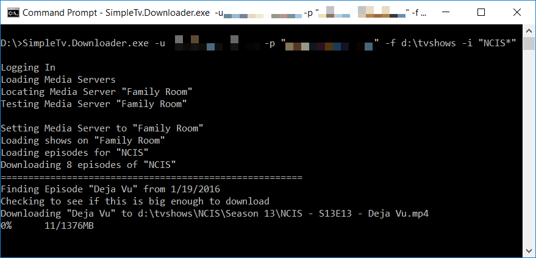

# Simple.TV Downloader

If you have a [Simple.TV](https:/www.simple.tv) and want to copy your recordings from your Simple.TV, this project
is for you.  When run, SimpleTV Downloader will download all recordings to a directory you specify.  Use it like this:

`SimpleTv.Downloader.exe -u username@somewhere.com -p "P@ssw0Rd" -f c:\tvshows -i "NCIS*"`

In this screenshot, the Simple.TV DVR is on the same LAN as the computer running the Downloader, but the downloader will also work across the Internet.

The downloader names the files intelligently and files them in a folder per show.  By default, the folder and file naming is [Plex friendly](https://support.plex.tv/hc/en-us/articles/200220687-Naming-Series-Season-Based-TV-Shows).

## Command Line Parameters

For full documentation on the command line parameters available, see the [Parameters documentation](doc/Parameters.md).

## Customizing Folder\\Filename

To learn how to customize how the files are saved, see the [NamingFormat documentation](doc/NamingFormat.md).

## Troubleshooting

If you have problems or the downloader crashes, run it again with `-l` on the end of the command to log the HTTP requests and responses to a log file.  After the problem happens again, create an Issue on this repository and attach your log file so that we can troubleshoot and fix the bug.

## Downloads

Download the latest version from the [Releases Page](https://github.com/codethug/SimpleTv/releases).

## Contributions

If you'd like to contribute, before creating a pull request, please open a new [Issue](https://github.com/codethug/SimpleTv/issues) or find an existing Issue and comment saying you'd like to work on it, and I'll work with you to make sure we're going in the same direction.

## Thanks

Thanks to jschwalbe for [his bookmarklet](http://community.simple.tv/index.php?/topic/953-download-video-files-with-this-new-bookmarklet) which both inspired me to write Simple.TV Downloader and showed me how to format a URL so that a show can be downloaded.

## Legal

#### License

Simple.TV Downloader is Open Source software licensed under the [MIT License](LICENSE)

#### Trademark

Simple.TV is a registered trademark of Really Simple Software, Inc.  This project is not endorsed, sponsored, or certified by Simple.TV or Really Simple Software, Inc.
